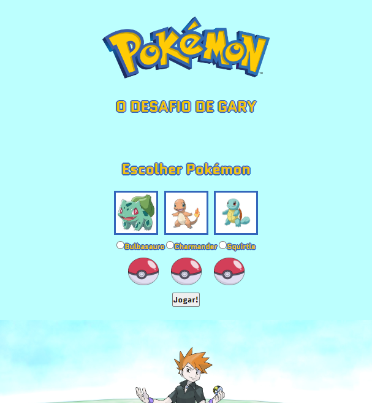

# Pokémon! Desafio de Gary (Gary's Challenge)

> Pokémon!

Esse é um jogo de pedra, papel e tesoura, mas com os Pokémons da primeira geração. 
Faça sua escolha e tente vencer Gary! Ele irá escolher aleatoriamente entre Bulbassauro, Charmander e Squitle. Lembre-se:
- Fogo vence planta;
- Água vence fogo;
- Planta vence água.

*It's a rock, paper, scissors game, but with the initials from Gen I of Pokémon! Make your choice and yry to beat Gary! He will choose randomly between Bulbasaur, Charmander and Squirtle. Remember:*
*- Fire beats plant;*
*- Water beats fire;*
*- Plant beats water;*

[Clique aqui para acessar](https://matazzo.github.io/)

## Tecnologias

- HTML
- CSS
- Javascript
- Git e Github

## Contato

mathrsilverio@gmail.com